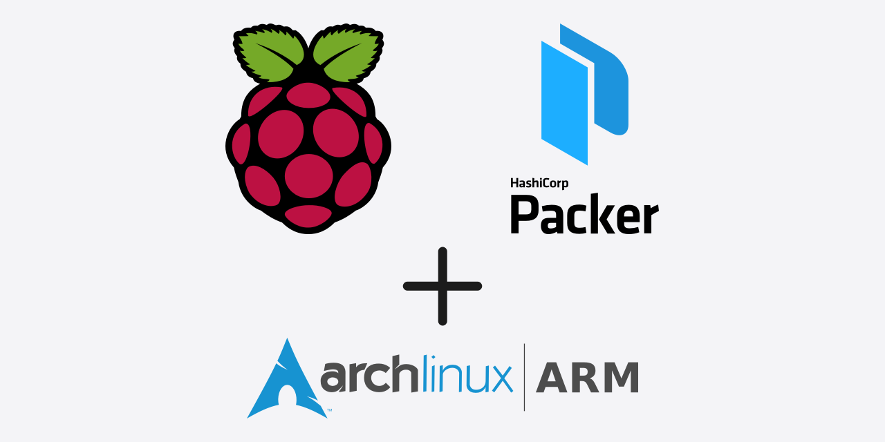
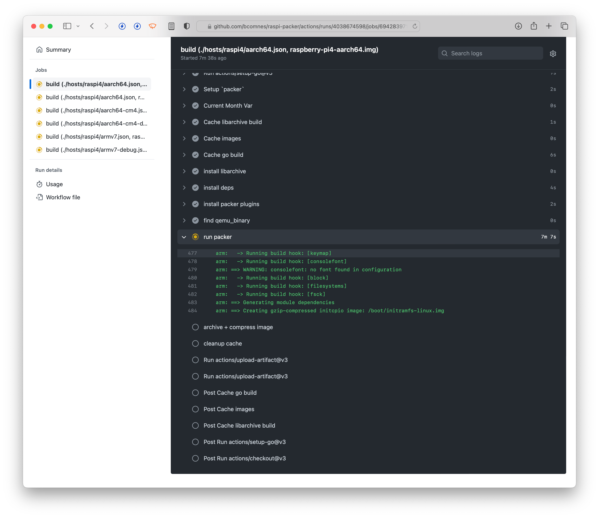
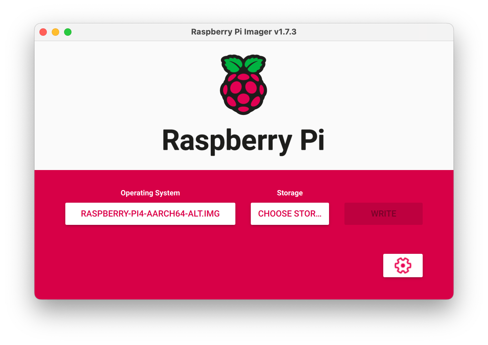

# raspi-packer

Build various configurations of [Arch Linux Arm](https://archlinuxarm.org) in a GitHub action using [packer](https://www.packer.io) and [mkaczanowski/packer-builder-arm](https://github.com/mkaczanowski/packer-builder-arm) into an ISO that you can flash with [Raspberry Pi Imager](https://www.raspberrypi.com/software/).

Includes a [bootstrap](./boostrap.sh) script that lets you customize the image, and include first run utilities for resizing partitions or doing other first run activities. 

## Why?

Bootstrapping arch arm is non-trivial and tedious. This lets you automate away the most tedious portions of the process. Its still slow but once its working can save a lot of time (like all automation).

## Instructions

Push changes to the repo, and images are built on the push event. If the build succeeds, you can find the images as artifacts located on the action run. 

- hosts: this folder has various packer entry points for various hosts builds. Overlays over the packer.json file settings.
- bootstrap.sh: The script that runs to build the image
- packer.json: The base packer configuration.

### Can I use it?

Anyone can use this, though the customizations are pretty specific for my own use case. You are better off forking the repo and making whatever modifications you want to your own build pipeline.

## Screenshots

## See also

- https://disconnected.systems/blog/raspberry-pi-archlinuxarm-setup
- https://gist.github.com/larsch/4ae5499023a3c5e22552

